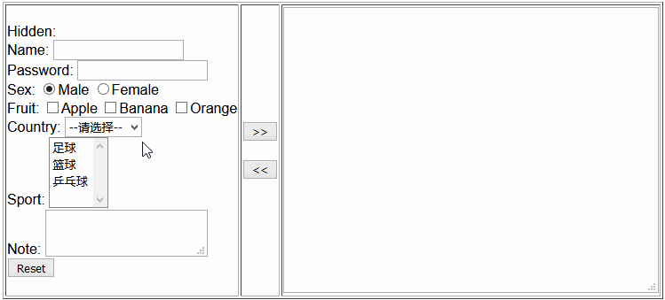
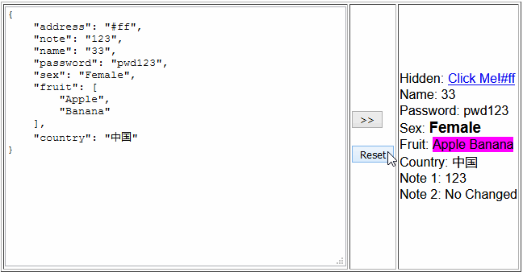

# jDataExchange

jDataExchange——一个用来做html界面元素与json数据进行交换的javascript库

[示例](./examples/README.md)

## 描述
为了从繁琐的html的数据表单中进行数据与json数据交换后，表单的元素input,select,textarea等的值属性名称都是固定的不变的，利用javascript的反射机制将json数据对应key与表单元素相应的key(一般是name属性的值作为key)一一对应起来，从而实现了jDataExchange这个库来使用简单的几句JS代码实现了从表单数据获取数据到json数据中与将json数据设置到表单数据中。

jDataExchange采用是JS+DOM的方式进行编写的，所以jDataExchange可以与其他框架如React,PHP等无缝对接使用。
jDataExchange与html5的formdata的区别：

优点：  
1. 不需要浏览器的html5特性支持  
2. formdata的数据无法设置到表单中 

缺点：  
1. 不支持file类型的获取与设置
2. 一次获取与设置仅支持各标签的一个属性

### [示例在表单中使用](./examples/simple.html)


### [示例在显示标签中使用](./examples/display.html)



## 如何使用
1. 设计好你的网页界面，[例如](./examples/simple.html)如下：
```html
<form id="myform">
    Hidden: <input name="_csrf" type="hidden" value=""/> <br/>
    Name: <input name="name" type="text" value="" /> <br/>
    Password: <input name="password" type="password" value="" /> <br/>
    Sex: <input name="sex" type="radio" value="Male" checked="checked"/>Male
    <input name="sex" type="radio" value="Female"/>Female <br/>
    Fruit: <input name="fruit" type="checkbox" value="Apple"/>Apple
    <input name="fruit" type="checkbox" value="Banana"/>Banana
    <input name="fruit" type="checkbox" value="Orange"/>Orange <br/>
    Country: <select name="country">
    <option value="">--请选择--</option>
    <option value="中国">中国</option>
    <option value="美国">美国</option>
    </select><br/>
    Sport: <select name="sport" multiple="multiple" >
    <option value="足球">足球</option>
    <option value="篮球">篮球</option>
    <option value="乒乓球">乒乓球</option>
    </select><br/>
    Note: <textarea name="note"></textarea><br/>
    <input type="reset" value="Reset"/> <br/>
</form>
```

2. 使用script标签导入jDataExchange
```html
<script type="text/javascript" src="../src/jdataexchange.js"></script>
```

3. 输入表单后编写如下js代码从界面获取数据值填充到json对象中
```javascript
var jsonObj = {};
jdx("myform").get(jsonObj);
```
调用如上js代码后示例的JSON对象填充如下
```javascript
{
    "_csrf": "xxxxxxxx",
    "note": "xxxxxxxx",
    "name": "xxxxxxxx",
    "password": "xxxxxxxx",
    "sex": "xxxxxxxx",
    "fruit": [
        "xxxxxxxx",
        "xxxxxxxx"
        ],
        ,
    "country": "xxxxxxxx",
}
```

4. 将json对象值设置到表单也是在表单加载完成后调用如下js代码
```javascript
var jsonObj = {...};
jdx("myform").set(jsonObj);
```


## API jdx
* @brief jDataExchange的构造函数
* @param htmlEle 需要进行操作的element对象，也可以是element的id字符串
* @param config 配置参数，可以不写，如有效将和defautlConfig合并成新的配置参数
* @param win window对象，默认在浏览器中不需要设置，在nodejs中，当htmlEle为字符串时需要设置win对象
* @return 本例类实例对象
*
```javascript
function DataExchange(htmlEle, config, win)
```


## API get
* @brief 将form的输入element值获取到json对象
* @param jsonObj json对象
* @param paramConfig 配置参数，可以不写，如有效将和当前实例的配置对象合并成新的配置参数
* @return 本例类实例对象
*
```javascript
DataExchange.prototype.get = function (jsonObj, paramConfig)
```

## API set
* @brief 将json对象的值设置到html界面元素中
* @param jsonObj json对象
* @param paramConfig 配置参数，可以不写，如有效将和当前实例的配置对象合并成新的配置参数
* @return 本例类实例对象
*
```javascript
DataExchange.prototype.set = function (jsonObj, paramConfig)
```

## API getElements
* @brief 将html的element对象获取到json对象
* @param jsonObj json对象
* @param paramConfig 配置参数，可以不写，如有效将和当前实例的配置对象合并成新的配置参数
* @return 本例类实例对象
*
```javascript
DataExchange.prototype.getElements = function (jsonObj, paramConfig)
```

## 默认配置参数
```javascript
var defaultConfig = {
        // element属性值与json键一一对应起来，默认是element的name属性
        // 调用set函数的会做两个特殊处理：
        // 当有同名的函数存在会调用函数计算结果值给element，返回null或者undefined忽略设置
        /* function(eleItem, attrName, jsonObj, value, jsonKey, config)
         *
         * @brief 通过调用同名的function，将返回值设置给eleItem的attrName属性
         * @param eleItem 要设置的element
         * @param attrName 要设置的element的要设置的属性名称
         * @param jsonObj 对应的jsonObj
         * @param value 原始value将要设置给element的attrName属性
         * @param jsonKey 对应的jsonObj的key
         * @param config 配置参数
         * @return 最终的value将要设置给element的attrName属性，返回null或者undefined忽略设置
         */
        
        key: 'name',

        // 函数 function(eleItem, jsonKey, config) 返回true表示处理该eleItem,否则忽略
        eleFilter: null,

        // 函数 function((eleItem, attrName, jsonObj, value, jsonKey, config) 返回进行xss处理后的字符串值，返回null或者undefined忽略设置
        xssFilter: null,

        // 忽略处理element的data-jdx-ignore属性为true的元素
        ignoreFlag: 'data-jdx-ignore',

        // 将设置data-jdx-bind绑定的属性值
        customBind: 'data-jdx-bind',

        // 需要特殊设置的标签的值域，否则就按innerHTML处理
        htmlElements: [
            {name: 'button', value: 'disabled'},
            {name: 'a', value: 'href'},
            {name: 'img', value: 'src'},
            {name: 'tr', value: 'className'},
            {name: 'ul', value: 'className'},
            {name: 'ol', value: 'className'},
            {name: 'div', value: 'className'}
        ]
    };
```

## 代码测试
测试代码使用了模板字符串，需要安装支持模板字符串版本nodejs

1. 进入项目目录，安装依赖
```
cd jdataexchange
npm install
```
2. 代码测试
```
npm run test
```
3. 代码覆盖(覆盖率98%)
```
npm run cover
```

##    授权协议
基于[MIT](./LICENSE.md)协议。
